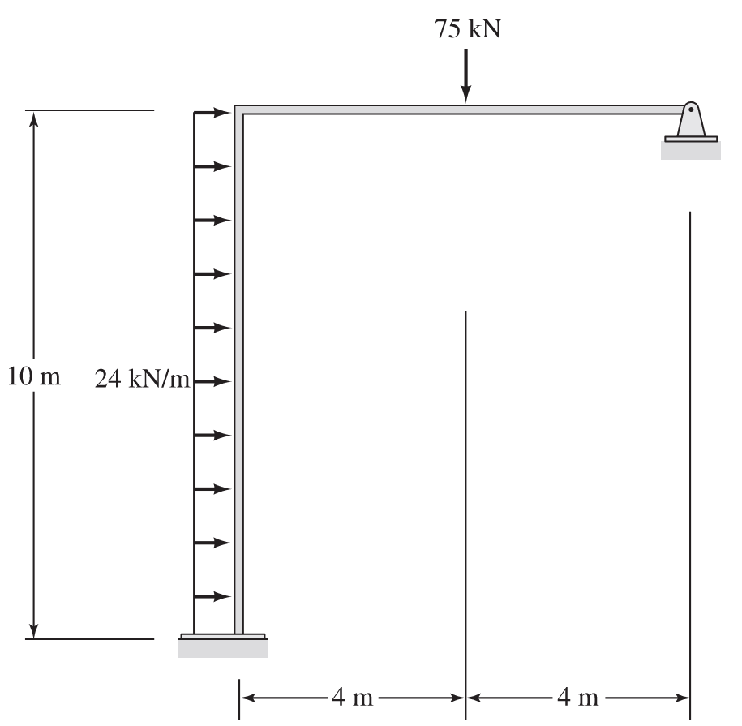

# CEE6501 — Written Assignment, Week 10

**Assigned:** 03/20/2026 (Week 10)

**Due:** 03/30/2026

**Canvas Submission Link:** <https://gatech.instructure.com/courses/517856/assignments/2320544>

---

## Logistics

### 📄 Assignment Format

This is a **written assignment**, not a coding assignment.

- Complete the assignment **by hand or typed up**
- You may write:
  - in a markdown or jupyter file
  - on paper
  - on a tablet
  - using a stylus or digital note-taking app
- After completing the assignment, **scan or export your work** and upload it to Canvas

You may use **any format you prefer**, but your submission \*_must be neat and legible_

### 📤 Submission Instructions

- Upload **one file** to Canvas
- Accepted formats: **PDF, PNG, or JPG**
- Make sure all pages are clearly visible and in the correct order

### ✅ Checklist Before Submitting

- [ ] Assignment completed by hand
- [ ] Writing is neat and legible
- [ ] Title block provided on each page
- [ ] All questions answered
- [ ] File uploaded successfully to Canvas

### 🤝 Collaboration / AI tools

You may discuss concepts with classmates and you may use AI tools to help you learn, but **your submitted work must be
written by you and you must understand it**. If you used outside help, add a short note in the final reflection cell.

---

---

## Revisit Frame Structure in `A7_written.md`

Using your solution to Question 2 in `A7_written.md` as the starting point, now apply the methods from Week 9 for
support displacements, temperature, and fabrication / fit-up forces.

You should treat this as an extension of your earlier DSM solution, not as a completely new problem. In particular, you
may use your previously assembled stiffness matrix, DOF partitioning, and element information from your `A7_written.md`
solution. For this assignment, the new effects enter through the **right-hand side of the equilibrium equations**, so
you do not need to reassemble the global stiffness matrix.

Hand-written solutions are acceptable — but they must be **neat, clearly organized, and easy to follow**. Clearly label
all steps, vectors, and intermediate results.

If possible, submit a clean solution in **Markdown** or a **Jupyter notebook**. A notebook allows you to structure your
work clearly, embed images, and present your solution as a short technical report that walks through your reasoning step
by step.

### Submit / report

For each of the question below, submit the following:

- The modified right-hand-side vector(s) used in the solution
- Global displacements at the **free DOFs**
- Global reactions at the **restrained DOFs**
- A **global equilibrium check**
- Local element end forces
- Local element end displacements
- A clear, neat sketch of the **deformed shape**

### Numbering conventions

- Number global nodes **bottom-left → top-left → top-right**
- Use the Lecture 7 DOF convention (1-based):
  - $\mathrm{DOF}(j, u_x) = 3j - 2$
  - $\mathrm{DOF}(j, u_y) = 3j - 1$
  - $\mathrm{DOF}(j, \theta) = 3j$

### Structural info

- $E, A, I$ are constant
- $E = 200~\text{GPa}$
- $A = 4740~\text{mm}^2$
- $I = 22.2\times 10^{6}~\text{mm}^4$
- use the $\alpha$ for steel as given in lecture

---

## Question 1 — Support Displacements

Starting from your solution to Question 2 in `A7_written.md`, redo the problem assuming the following prescribed support
motions:

- The **top-right pin support** moves **10 mm downward**
- The **top-right pin support** also moves **5 mm to the right**
- The **bottom-left support** undergoes a **counterclockwise rotation of 0.01 rad**

## Question 2 — Temperature Effects

Starting from your solution to Question 2 in `A7_written.md`, redo the problem assuming the following temperature
changes:

- **Vertical member:** uniform temperature increase of **+10°C**
- **Horizontal member:** temperature gradient of **+15°C at the top** and **+5°C at the bottom**

## Question 3 — Fabrication / Fit-up Errors

Starting from your solution to Question 2 in `A7_written.md`, redo the problem assuming the following fabrication
errors:

- **Vertical member:** fabricated **3 mm too short**
- **Horizontal member:** fabricated **3 mm too short**
