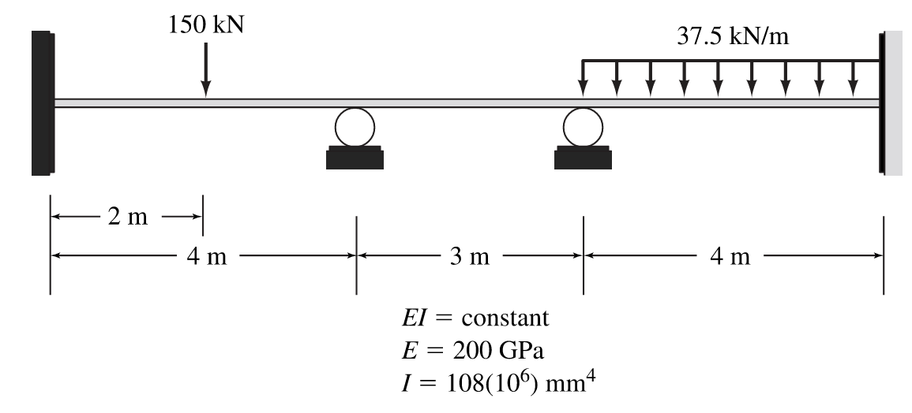

# CEE6501 — Written Assignment, Week 6

**Assigned:** 02/20/2026 (Week 6)

**Due:** 03/02/2026

**Canvas Submission Link:** <https://gatech.instructure.com/courses/517856/assignments/2320752>

## Logistics

### 📄 Assignment Format

This is a **written assignment**, not a coding assignment.

- Complete the assignment **by hand or typed up**
- You may write:
  - in a markdown file
  - on paper
  - on a tablet
  - using a stylus or digital note-taking app
- After completing the assignment, **scan or export your work** and upload it to Canvas

You may use **any format you prefer**, but your submission \*_must be neat and legible_

### 📤 Submission Instructions

- Upload **one file** to Canvas
- Accepted formats: **PDF, PNG, or JPG**
- Make sure all pages are clearly visible and in the correct order

### ✅ Checklist Before Submitting

- [ ] Assignment completed by hand
- [ ] Writing is neat and legible
- [ ] Title block provided on each page
- [ ] All questions answered
- [ ] File uploaded successfully to Canvas

### 🤝 Collaboration / AI tools

You may discuss concepts with classmates and you may use AI tools to help you learn, but **your submitted work must be
written by you and you must understand it**. If you used outside help, add a short note in the final reflection cell.

---

## Question 1 — Indeterminate Beam (DSM by Hand)

Using the methods from **Lecture 6**, solve the indeterminate beam below **by hand** using the **Direct Stiffness Method
(DSM)**. Follow the step-by-step procedure at the end of **Lecture 6.3**.

Hand-written solutions are acceptable — but they must be **neat, clearly organized, and easy to follow**. Clearly label
all steps, matrices, and intermediate results.

If possible, submit a clean solution in **Markdown** or a **Jupyter notebook**. A notebook allows you to structure your
work clearly, embed images, and present your solution as a short technical report that walks through your full reasoning
step by step.

**Submit / report:**

- Global displacements at the **free DOFs**
- Global reactions at the **restrained DOFs**
- A **global equilibrium check**
- Local element end forces
- Local element end displacements
- A clear, neat sketch of the **deformed shape**

**Numbering conventions:**

- Number global nodes **left → right**
- Use the Lecture 6 DOF convention (1-based):
  - $\mathrm{DOF}(j, u_y) = 2j - 1$
  - $\mathrm{DOF}(j, \theta) = 2j$

**Structural info:**

- $E, I$ are constant
- $E = 200~\text{GPa}$
- $I = 108\times 10^{6}~\text{mm}^4$

---

## Question 2 — Indeterminate Frame (DSM by Hand)

Using the methods from **Lecture 7**, solve the indeterminate frame below **by hand** using the **Direct Stiffness
Method (DSM)**. Follow the step-by-step procedure at the end of **Lecture 7.2**.

Hand-written solutions are acceptable — but they must be **neat, clearly organized, and easy to follow**. Clearly label
all steps, matrices, and intermediate results.

If possible, submit a clean solution in **Markdown** or a **Jupyter notebook**. A notebook allows you to structure your
work clearly, embed images, and present your solution as a short technical report that walks through your full reasoning
step by step.

**Submit / report:**

- Global displacements at the **free DOFs**
- Global reactions at the **restrained DOFs**
- A **global equilibrium check**
- Local element end forces
- Local element end displacements
- A clear, neat sketch of the **deformed shape**

**Numbering conventions:**

- Number global nodes **bottom-left → top-left → top-right**
- Use the Lecture 7 DOF convention (1-based):
  - $\mathrm{DOF}(j, u_x) = 3j - 2$
  - $\mathrm{DOF}(j, u_y) = 3j - 1$
  - $\mathrm{DOF}(j, \theta) = 3j$

**Structural info:**

- $E, A, I$ are constant
- $E = 200~\text{GPa}$
- $A = 4740~\text{mm}^2$
- $I = 22.2\times 10^{6}~\text{mm}^4$

