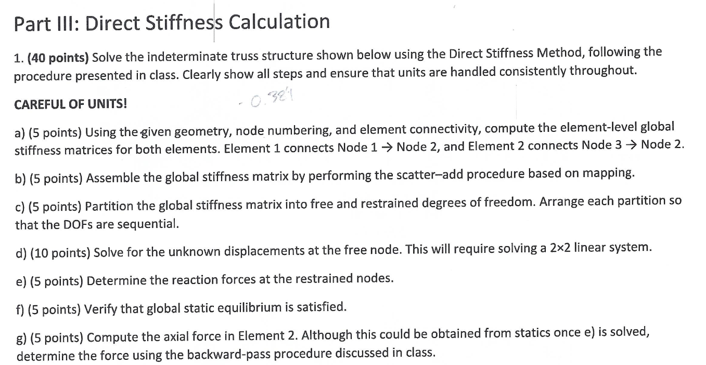
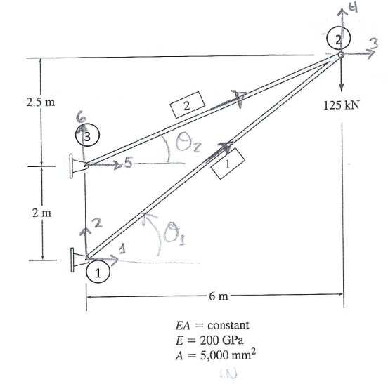
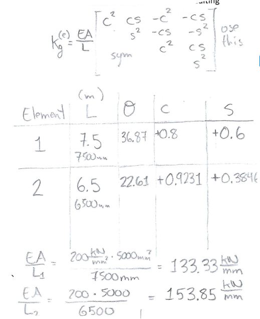
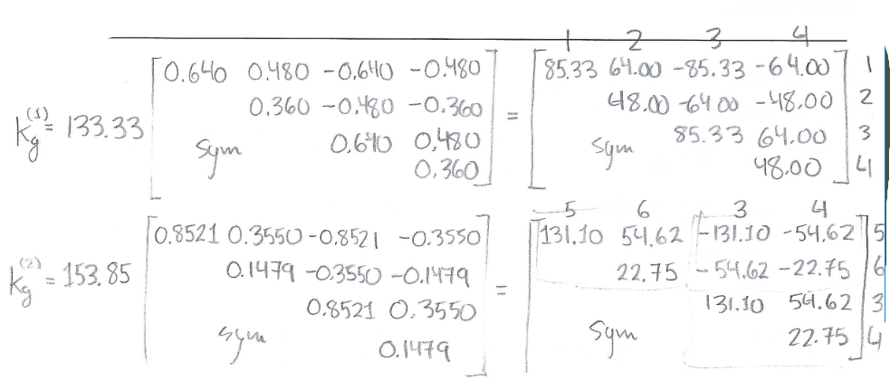
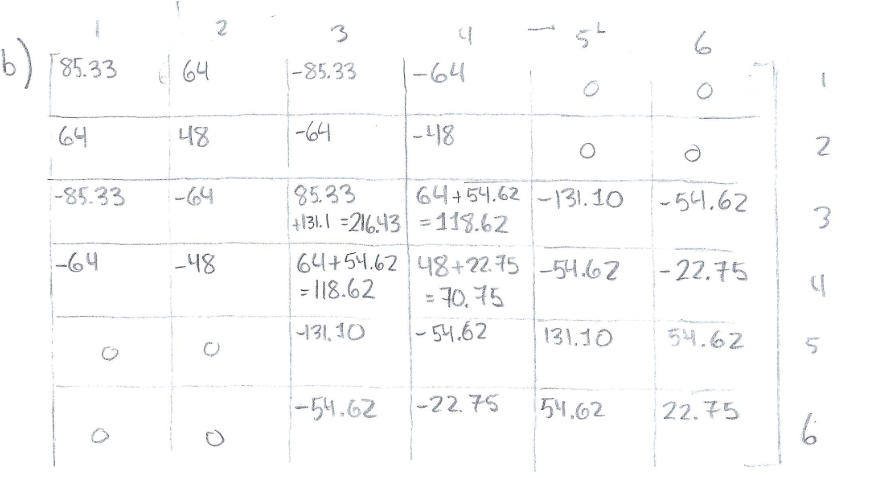
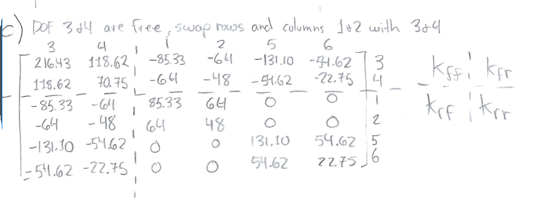
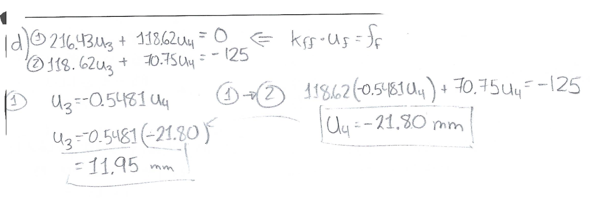
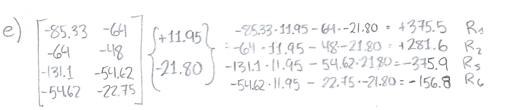
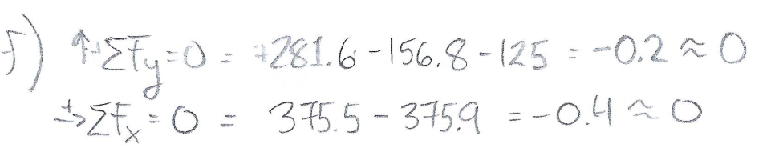
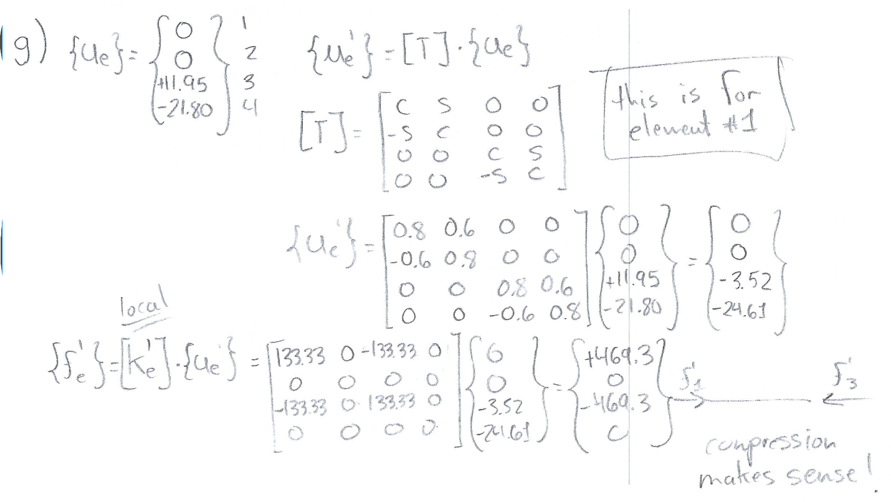

# Midterm Review — Full DSM Solution Walkthrough

In this review, we go step-by-step through a full midterm-style problem.

For each part:

- First, the **handwritten solution** (as it might appear during an exam)
- Then, the **clean, structured mathematical solution**

## (a) Element-Level Global Stiffness Matrices

Element 1: Node 1 → Node 2  
Element 2: Node 3 → Node 2

$$
\frac{EA}{L_1} = \frac{200 \times 5000}{7500} = 133.33 \, \text{kN/mm}
$$

$$
\frac{EA}{L_2} = \frac{200 \times 5000}{6500} = 153.85 \, \text{kN/mm}
$$

### Handwritten Work

### Final Matrices

$$
\mathbf{k}^{(1)} =
\begin{bmatrix}
 85.33 &  64.00 & -85.33 & -64.00 \\
 64.00 &  48.00 & -64.00 & -48.00 \\
-85.33 & -64.00 &  85.33 &  64.00 \\
-64.00 & -48.00 &  64.00 &  48.00
\end{bmatrix}
$$

$$
\mathbf{k}^{(2)} =
\begin{bmatrix}
 131.10 &  54.62 & -131.10 & -54.62 \\
  54.62 &  22.75 &  -54.62 & -22.75 \\
-131.10 & -54.62 &  131.10 &  54.62 \\
 -54.62 & -22.75 &   54.62 &  22.75
\end{bmatrix}
$$

## (b) Global Assembly

### Handwritten Work

### Final Global Matrix

$$
\mathbf{K} =
\begin{bmatrix}
 85.33 &  64.00 & -85.33 &  -64.00 &   0      &   0      \\
 64.00 &  48.00 & -64.00 &  -48.00 &   0      &   0      \\
-85.33 & -64.00 & 216.43 & 118.62  & -131.10  & -54.62   \\
-64.00 & -48.00 & 118.62 &  70.75  &  -54.62  & -22.75   \\
  0     &   0     & -131.10 & -54.62 & 131.10 &  54.62   \\
  0     &   0     &  -54.62 & -22.75 &  54.62 &  22.75
\end{bmatrix}
$$

## (c) Partition the Matrix

### Handwritten Work

$$
\mathbf{K} =
\left[
\begin{array}{cc:cccc}
 216.43 & 118.62 & -85.33 & -64.00 & -131.10 & -54.62 \\
 118.62 &  70.75 & -64.00 & -48.00 &  -54.62 & -22.75 \\
 \hdashline
 -85.33 & -64.00 &  85.33 &  64.00 &    0     &   0     \\
 -64.00 & -48.00 &  64.00 &  48.00 &    0     &   0     \\
-131.10 & -54.62 &   0     &   0     & 131.10 &  54.62 \\
 -54.62 & -22.75 &   0     &   0     &  54.62 &  22.75
\end{array}
\right]
$$

## (d) Solve for Unknown Displacements

### Handwritten Work

$$
\begin{aligned}
(1)\quad &216.43\,u_3 + 118.62\,u_4 = 0 \\
(2)\quad &118.62\,u_3 + 70.75\,u_4 = -125
\end{aligned}
$$

## (e) Reaction Forces

### Handwritten Work

$$
R_1 = 375.5, \quad R_2 = 281.6
$$

$$
R_5 = -375.9, \quad R_6 = -156.8
$$

## (f) Global Equilibrium Check

### Handwritten Work

$$
\sum F_y = 281.6 - 156.8 - 125 \approx 0
$$

$$
\sum F_x = 375.5 - 375.9 \approx 0
$$

Small residuals are due to rounding.

## (g) Backward Pass — Axial Force

### Handwritten Work

$$
\{f'_e\} =
\begin{Bmatrix}
469.3 \\
0 \\
-469.3 \\
0
\end{Bmatrix}
$$

Element is in compression.
